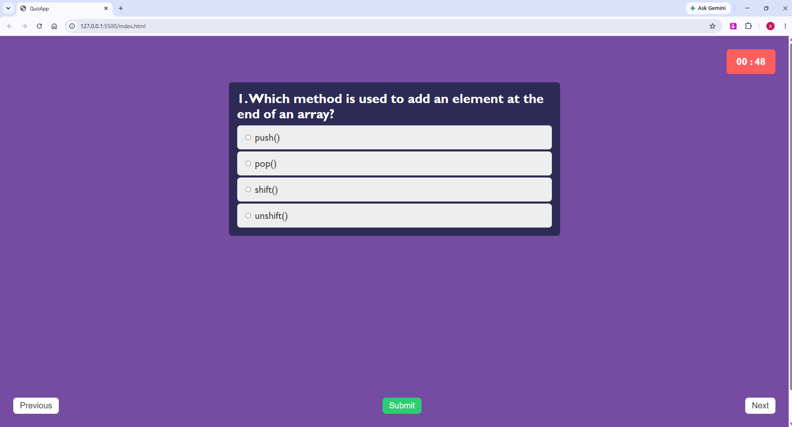
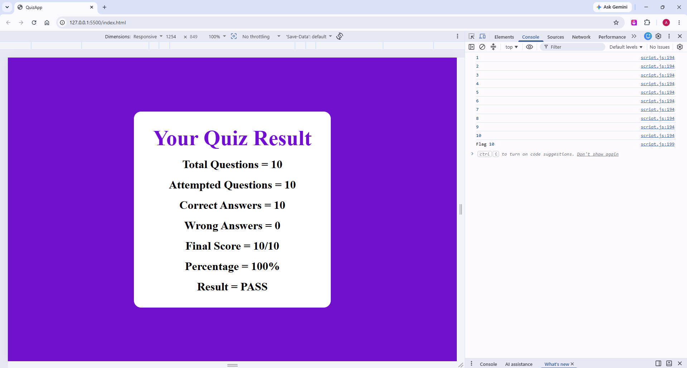

# 🧠 JavaScript Quiz App

An interactive **Quiz Application** built using **HTML, CSS, and Vanilla JavaScript**. The application presents JavaScript multiple-choice questions with a countdown timer, intuitive navigation controls, and a detailed performance report upon completion.

---

## 🌟 Features

- 📝 10 JavaScript Multiple Choice Questions
- ⏱️ 60-Second Timer for Every Question
- ⬅️ Previous & Next Navigation
- 📤 Quiz Submission
- 🎯 Automatic Score Calculation
- 📊 Detailed Result Summary
- ✅ Correct & Wrong Answer Count
- 📈 Percentage Calculation
- 🏆 Pass / Fail Status
- 🎨 Clean & Modern User Interface
- 📱 Responsive Layout

---

## 🎥 Demo Video

📽️ **Watch the complete project demonstration here:**

👉 **https://drive.google.com/file/d/1J7ocyTuKymT68RhtIhtltsBE9Wzw4U0w/view?usp=sharing**

---

## 📸 Screenshots

### 📝 Quiz Interface



### 📊 Result Screen



---

## 🛠️ Technologies Used

- HTML5
- CSS3
- JavaScript (ES6)
- Visual Studio Code

---

## 📂 Folder Structure

```text
Quiz-App/
│
├── images/
│   ├── quiz-preview.png
│   └── result-preview.png
│
├── index.html
├── style.css
├── script.js
├── README.md
└── LICENSE (Optional)
```

---

## 🚀 Getting Started

### 1. Clone the Repository

```bash
git clone https://github.com/YOUR_GITHUB_USERNAME/Quiz-App.git
```

### 2. Open the Project

Open the project folder using **Visual Studio Code**.

### 3. Run the Application

Open **index.html** in your browser or run it using the **Live Server** extension.

---

## 🎮 How to Use

1. Start the quiz.
2. Read each question carefully.
3. Select the correct answer.
4. Navigate using the **Previous** and **Next** buttons.
5. Submit the quiz after answering all questions.
6. View your final score and performance summary.

---

## 📊 Result Summary

The application displays:

- 📌 Total Questions
- ✍️ Attempted Questions
- ✅ Correct Answers
- ❌ Wrong Answers
- 🏅 Final Score
- 📈 Percentage
- 🎯 Pass / Fail Status

---

## 💡 Concepts Used

This project helped me strengthen my understanding of:

- DOM Manipulation
- Arrays & Objects
- Event Handling
- Form Handling
- Radio Buttons
- Template Literals
- Conditional Statements
- Loops
- Functions
- Timers (`setInterval()` & `clearInterval()`)
- Dynamic HTML Rendering

---

## 🚀 Future Improvements

- 💾 Save selected answers while navigating
- 🔀 Shuffle questions and answer options
- 📊 Progress Bar
- 🌙 Dark / Light Mode
- 🔊 Sound Effects
- 🎉 Better UI Animations
- 📱 Improved Mobile Responsiveness
- 💾 Store Quiz History using Local Storage
- 📄 Review Answers After Submission
- 🏅 Leaderboard

---

## 🤝 Contributing

Contributions, suggestions, and improvements are always welcome.

If you'd like to contribute:

- 🍴 Fork this repository
- 🌿 Create a new branch
- 💻 Make your changes
- 📩 Submit a Pull Request

Every contribution is appreciated!

---

## 👩‍💻 Author

**Aastha Tilala**

🎓 Second-Year Computer Engineering Student

💻 Passionate about Frontend Web Development

🚀 Currently learning JavaScript by building real-world projects and continuously improving my development skills.

---

## 🌐 Connect with Me

- **GitHub: https://github.com/AasthaTilala27

---

## ⭐ Show Your Support

If you enjoyed this project or found it helpful, consider supporting it by:

- ⭐ Star this repository
- 🍴 Fork the project
- 📝 Share your feedback by opening an Issue
- 🚀 Share it with your friends and fellow developers

Your support motivates me to continue learning and building more exciting projects.

---

## 📬 Feedback

Have a suggestion or found a bug?

I'd love to hear your feedback! Feel free to open an **Issue** or submit a **Pull Request**.

Every suggestion helps me improve as a developer.

---

## 🙌 Thank You

Thank you for taking the time to explore this project.

I hope you enjoyed checking it out as much as I enjoyed building it. This project reflects my journey of learning JavaScript through hands-on practice, and I'm excited to continue creating more projects in the future.

If you found this project useful, don't forget to **⭐ Star the repository**. Your support means a lot and encourages me to keep learning, building, and sharing.

**Thank you for visiting! Happy Coding! 🚀💜**
